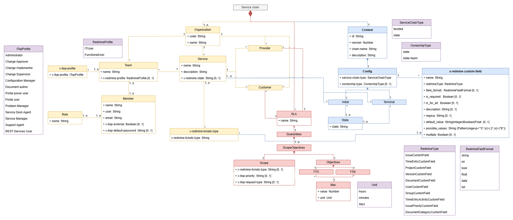
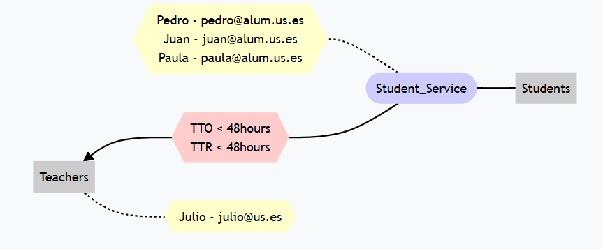
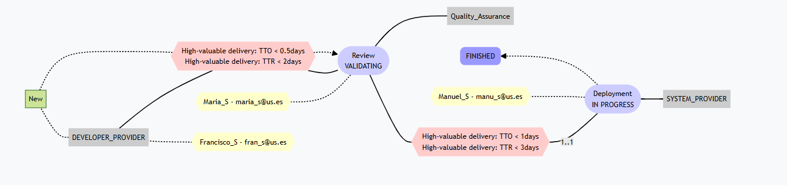

# Lucid Chain Wizard Specification

The key words "MUST", "MUST NOT", "REQUIRED", "SHALL", "SHALL NOT", "SHOULD", "SHOULD NOT", "RECOMMENDED", "MAY", and "OPTIONAL" in this document are to be interpreted as described in [RFC 2119](http://www.ietf.org/rfc/rfc2119.txt).

## Revision History

|Version  | Date         | Notes                          |
|:------- |:------------ |:---------------------------    |
| 1.0     | 2025   | Initial service chain modeling version.               |

## Introduction

**Lucid Chain Wizard** provides a service chain modeling language that is capable of specify many service chains configurations such as its type or TTO calculus. LCW helps to
import and export service chains from ITop and Redmine, and it can also give some detailed metrics about SLA compliance. In this page we will describe this language.

## What is a service chain

A service chain is a set of two or more organizations that are related to each other through at least one service, in which a series of agreements are involved through an SLA.
In this SLA we can specify TTO and TTR values. Once we have this structure, we can represent it in a yaml file and use it in ITop or Redmine using Lucid Chain WIzard.

Before we start introducing the yaml structure and all the possible options that it provides, we are going to describe some concepts:

+ <u>***Incident/request/issue:***</u> It is a need reported by a customer. It must be handled by an organization following its repective SLA rules. For us every term such as incident, service request, user request and so on will be treated and refered as ***"issue"***.

+ <u>***TTO:***</u> It means Time To Ownership. It is the time it takes for a team or individual to be ***assigned*** to an issue after it has been created or its state changed.

+ <u>***TTR:***</u> It means Time To Resolve. It is the time it takes for an issue to be ***closed*** since it has been assigned to someone or a team.

## Specification

A **service chain model** description is a [YAML](http://yaml.org/spec) document with following structure. Note that primitive data types in the service chain model specification are based on the types supported by the [JSON-Schema Draft 4](http://json-schema.org/latest/json-schema-core.html#anchor8).

  
<p align="center">
  <strong>Figure 1:</strong> <em>SCModel UML Representation.</em>
</p>

As you can see in Figure 1, SCModel specifications is complex. The UML has different colors to make it easier to understand each part:

+ <u>***Grey:***</u> This color is used to represent the whole service chain.
+ <u>***Purple:***</u> This color is used to represent all ***Enums*** in SCModel notation.
+ <u>***Blue:***</u> This color is used to represent all the parts related with SCModel ***service chain configuration***.
+ <u>***Light orange:***</u> This color is used to represent all the parts related with ***organizations***, including teams, services and people.
+ <u>***Pink:***</u> This color is used to represent all the parts related with ***SLAs*** and objectives.

## Type faceted chains

In service chains with type *faceted* we have a simplified incident management. In this type of service chains the customer created an issue for its provier. The issue is assigned to a team and later to a person. When this happens, TTO is calculated as the time between its creation and its asignation. Once TTO is calculated, we start to count TTR until the issue has been resolved. Although the issues have states, they are always associated with the same service. If during the issue management the provider organization has to pass the resposability to one of its providers, a new issue between them must be created. In these cases we can close or pause the original issue. This way of managing issues makes a bit difficult tracking whether the first provider or any of its providers are fullfiling the SLAs or not. However, it is simpler and easier to understand. Faceted chains usually are usefull when there are no third party services interacting with the client.

We can represent faceted service chains as a directed graph, where the edges always represent a new issue creation.

  
<p align="center">
  <strong>Figure 2:</strong> <em>Graph representation of a service chain type faceted chain.</em>
</p>

## Type state chains

In type *state* service chains issue management is more complex but it is more efficent to detect who is not passing SLAs. In type state, when an issue is created, it has an state, which is related to just one service. In case this service needs to pass the responsability to another, it does it using the same issue, but changing its state. TTO is calculated as the sum of time the issue is not assigned to an user or a team. In case ownership-type is state, TTO is the sum of the times between the issue changes to a new state until is assigned to a person. In case ownership-type is state+team, it is calculated as the sum of the times between the issue is assigned to a new team until is assigned to a person.
In type state service chains we must define initial and terminal services, because we can represent this chains as bidirectional graphs. At this point, the only way to determine where we can start or end the process is defining this flow. Here the edges means a issue changing its state. We also need to define an initial SLA, because issue creation is a special moment that just can be done once.


<p align="center">
  <strong>Figure 3:</strong> <em>Graph representation of a service chain type state chain.</em>
</p>

## Yaml structure  

| Field name    | Field type                          | Required/Optional | Description  |
|--------------|-----------------------------------|-------------------|-------------|
| context           | [Context](#context)                         | **Required**      | Service chain context and general configuration  |
| orgs      | [Organization](#organization)                         | **Required**      | List of all organizations including its services and teams  |
| sla       | [SLA](#sla)   | **Required**      | List of all SLAs involved in the service chain and its guarantees. |
| x-redmine-profiles-permissions       | [RedmineProfilePermissionsObject](#redmineprofilepermissionsobject)   | Optional      | List of all privileges and properties from redmine profiles defined in the chain. |

---

**NOTE:** It is not allowed to include the prefix ***"_DEPRECATED_"*** in any name or value for any property.

### Yaml structure example

```yaml
context:  Context
orgs:  Organization[]
sla: SLA[]
```

## Context

This section of the yaml defines the service chain configuration. It is essential in order to understand how the chain works and some extra information.

### `Context`  

| Field name    | Field type                          | Required/Optional | Description  |
|--------------|-----------------------------------|-------------------|-------------|
| id           | `Number`                         | **Required**      | Unique identifier for the service chain. |
| version      | `Number`                         | **Required**      | Version number of the context. |
| config       | [Configuration](#configuration)   | **Required**      | Configuration details of the service chain. |
| chain-name   | `String`                          | Optional      | Name of the service chain. It is highly recommended to include that property. |
| description  | `String`                          | Optional      | Description of the service chain. |

---

#### Context example

```yaml
  id: 1
  version: 1
  config: Configuration
  chain-name: "Plane pieces quality assurance service chain"
  description: "This service chain contains all the services required to ensurance quality in plane pieces."
```

### `Configuration`  

| Field name         | Field type                              | Required/Optional | Description  |
|-------------------|--------------------------------------|-------------------|-------------|
| service-chain-type | [ServiceChainType](#servicechaintype)                            | **Required**      | Type of service chain. |
| initial           | [ServiceStateObject[]](#servicestateobject) | Optional      | List of initial services and their states. It is not optional if chain type is state. |
| terminal          | [ServiceStateObject[]](#servicestateobject) | Optional      | List of terminal services and their states. It is not optional if chain type is state. |
| x-redmine-custom-fields          | [RedmineCustomFieldObject[]](#redminecustomfieldobject) | Optional      | List of Redmine custom fields that will be added to your Redmine's entities. |
| ownership-type    | [OwnershipType](#ownershiptype)                            | Optional      | Defines the ownership type. By default its value is 'state' It is not optional if chain type is state. |
| initial-sla      | `String`                            | Optional      | It is the **name** of the initial SLA assigned to the service chain. It will be the SLA taken into account when a new issue is created and it has not changed its state. It is not optional if chain type is state. |

---

#### Configuration type state example

```yaml
  service-chain-type: "state" 
  initial: ServiceStateObject[]
  terminal: ServiceStateObject[]
  ownership-type: "state+team"
  initial-sla: "REVIEW_SHIP_SLA"
  x-redmine-custom-fields: RedmineCustomFieldObject[]
```

##### Configuration type faceted example

```yaml
  service-chain-type: faceted
```

### `ServiceChainType`

| Value  | Description  |  
|-------- |------------- |  
| `state`   | Represents type state chains. It means that issues change its states instead of being closed/stopped when it is necessary to contact another service in order to solve them. |  
| `faceted`  | Represents type faceted chains. It means that issues closed/stopped and a new issue is created when it is necessary to contact another service in order to solve them. |

---

### `ServiceStateObject`  

| Field name  | Field type        | Required/Optional | Description  |
|------------|------------------|-------------------|-------------|
| service    | `String`          | **Required**      | It is the **name** of the service. Use `"*"` when you want to include all services. |
| states     | `String[]`        | **Required**      | List of states associated with the service. This states will be terminal or initial, and that means they have a special meaning because they start or end the flow. |

---

#### ServiceStateObject example

```yaml
  service: "Review ship"
     states:
       - "STUDYING"
       - "DRAFT"
```

This means that the service with the name "Review ship" has 2 terminal or initial states (depending on where this ServiceStateObject is). Theese states are "STUDYING" and "DRAFT".

### `RedmineCustomFieldObject`

| Field name     | Field type                          | Required/Optional | Description |
|---------------|------------------------------------|-------------------|-------------|
| name         | `String`                           | **Required**       | Name of the Redmine custom field. |
| redmineType  |  [RedmineType](#redminetype)                      | **Required**       | The type of the Redmine custom field. |
| field_format | [RedmineFieldFormat](#redminefieldformat)              | Optional           | Defines the format of the field. By default its value is ***string***. |
| is_required  | `Boolean`                         | Optional           | Indicates whether the field is required or not. By default its value is ***false***. |
| is_for_all   | `Boolean`                         | Optional           | Specifies if the field applies to all new objects from the Type specified in RedmineType. By default its value is ***true***. |
| description  | `String`                           | Optional           | Additional description of the custom field. By default its value is ***...***. |
| regexp       | `String`                           | Optional           | Regular expression pattern to validate the field input. ***It can only have a value if  field_format is string***|
| default_value | `String\|Integer\|Boolean\|Float\Date` | Optional           | Default value for the custom field if not specified. Take into account that its value must be the same type as field_format. |
| possible_values | `String` | Optional           | Possible values that will appear in the list. It must be a string with values separated by commas. For example: `"option1,option2,option3,option4"`. Note that this property is only available if field_format is **list**, and in that case this property is required |
| multiple | `Boolean` | Optional           | This property allows users to add more than one value to the list. By default its value is **false**.  Note that this property is only available if field_format is **list** |
| x-redmine-tickets-types | [TicketTypeEnum[]](#tickettypeenum) | Optional | List of Redmine ticket types whose issues will have this custom values. If this property is not present, LCW assumes its for all ticket types. |

#### RedmineCustomFieldObject example

```yaml
    name: 'Phone'
    field_format: 'string'
    redmineType: 'UserCustomField'
    regexp: '(?:\+34\s?)?(6\d{8}|7\d{8}|8\d{8}|9\d{8})'
```

### `RedmineType`

This property is related to the entity in which we want to include the new custom field. Redmine only allows the following values.

| Value  | Description  |  
|-------- |------------- |  
| `IssueCustomField`   | The custom field will be added as a property to Redmine issues. |  
| `TimeEntryCustomField`  | The custom field will be added as a property to Redmine Time entries. |
| `ProjectCustomField`  | The custom field will be added as a property to Redmine projects. |
| `VersionCustomField`  | The custom field will be added as a property to Redmine version objects. |
| `DocumentCustomField`  | The custom field will be added as a property to Redmine document objects. |
| `UserCustomField`  | The custom field will be added as a property to Redmine users. |
| `GroupCustomField`  | The custom field will be added as a property to Redmine groups. |
| `TimeEntryActivityCustomField`  | The custom field will be added as a property to Redmine activities. |
| `IssuePriorityCustomField`  | The custom field will be added as a property to Redmine issue priorities. |
| `DocumentCategoryCustomField`  | The custom field will be added as a property to Redmine document categories. |

### `RedmineFieldFormat`

This property specifies the type of the custom field that you want to add to your Redmine entities. In the future we may add some more but until now only the following are supported.

| Value  | Description  |  
|-------- |------------- |  
| `string`   | The custom field which will be added as a property to Redmine objects will be type ***String***. |  
| `text`   | The custom field which will be added as a property to Redmine objects will be large length type ***String***. |  
| `int`  | The custom field which will be added as a property to Redmine objects will be type ***Integer***. |
| `bool`  | The custom field which will be added as a property to Redmine objects will be type ***Boolean***. |
| `float`  | The custom field which will be added as a property to Redmine objects will be type ***Float***. |
| `date`  | The custom field which will be added as a property to Redmine objects will be type ***Datetime***. |
| `list`  | The custom field which will be added as a property to Redmine objects will be type ***List<String>***. |

### `OwnershipType`

This property default value is 'state'. It has really strong implications in TTO and TTR calculations,
which implies that it is common for all issues created.

| Value  | Description  |  
|-------- |------------- |  
| `state`   | Represents ownership-type state. It means that TTO is calculated as the sum of the times between each change of state and the moment the issue is assigned to a person. TTR is calculated as the sum of the times between each user assignation and each change of state. |  
| `state+team`  | Represents ownership-type state+team. It means that TTO is calculated as the sum of the times between each group assignation and the moment the issue is assigned to a person. TTR is calculated as the sum of the times betwwen each user asignation and each group assignation plus the time between the last group assignation and the closing date. |

---

## Organization Objects

Each Organization defined in **orgs** section must contain the following atributes and schema.

### `Organization`  

| Field name  | Field type                        | Required/Optional  | Description  |  
|------------ |---------------------------------|------------------- |------------- |  
| code        | `String`                         | **Required**       | Unique identifier for the organization. |  
| name        | `String`                         | **Required**       | Name of the  organization. It must be unique. |  
| teams       | [Team[]](#team)    | Optional       | List of all the teams of the organization involved in the chain. The organization must have teams in order to have services and be a client or a provider. |  
| services    | [Service[]](#service) | Optional       | List of services offered by the organization. The organization must have teams for its services. Moreover, services are required in order to be a provider. |  

---

#### Organization example

```yaml
code: "AQC"
name: "Aerospace Quality Corp"
teams: Team[]
services: Service[]
```

### `Team`  

It is necessary that we include x-redmine-profile property when importing a chain in Redmine, and x-itop-profiles when importing a chain in ITop.

| Field name  | Field type                        | Required/Optional  | Description  |  
|------------ |---------------------------------|------------------- |------------- |  
| name        | `String`                         | **Required**       | Name of the team. |  
| x-redmine-profiles | [RedmineProfile[]](#redmineprofile)                     | Optional       | Redmine profiles associated with the team. |  
| x-itop-profiles     | [ITopProfile[]](#itopprofile) | Optional       | List of all ITop profiles associated with the team. |  
| members     | [Member[]](#member) | **Required**       | List of all the team members. |

---

#### Team example

```yaml
name: "Inspection Team"
x-redmine-profiles: RedmineProfile[]
x-itop-profiles: ITopProfile[]
members: Member[]
```

### `RedmineProfile`  

Defines the possible Redmine profiles for the users in the team. This profiles allows users to have privileges for managing issues and other acitivities inside Redmine.  

**NOTE**: This privileges are inherited to all team members.

| Field name  | Field type                        | Required/Optional  | Description  |  
|------------ |---------------------------------|------------------- |------------- |  
| x-redmine-profile | `String`                     | **Required**       | Redmine profile name associated with the team. The privileges are specified in property `x-redmine-profiles-permissions` |  

If there are not any profiles defined, these are the ones used and their privileges.

| Value  | Description  |  
|----------------------------- |------------------------------------ |  
| `FunctionalUser`  | It has all the permissions available in Redmine. |  
| `ITUser`  | Currently it does not provide any privileges. In the future it might do it. |

#### RedmineProfile example

```yaml
x-redmine-profile: "Tester" 
```

---

### `ITopProfile`

This values are the currently available on ITop defaultly. You can have some additional information in the following [link](https://www.itophub.io/wiki/page?id=3_2_0:customization:profiles)
Here we leave the ITop official documentation chart about profiles.

**NOTE**: This privileges are inherited to all team members.

| Value                 | Description  |
|-------------------------|-------------|
| Administrator           | Has the rights on everything (bypassing any control). |
| Portal user             | Has the rights to access the user portal. People having this profile will not be allowed to access the standard application; they will be automatically redirected to the user portal. |
| Configuration Manager   | Person in charge of the documentation of the managed CIs. |
| Service Desk Agent      | Person in charge of creating incident reports. |
| Support Agent           | Person analyzing and solving the current incidents. |
| Problem Manager         | Person analyzing and solving the current problems. |
| Change Implementor      | Person executing the changes. |
| Change Supervisor       | Person responsible for the overall change execution. |
| Change Approver         | Person who could be impacted by some changes. |
| Service Manager         | Person responsible for the service delivered to the [internal] customer. |
| Document author         | Any person who could contribute to documentation. |
| Portal power user       | *(New in 2.0.1)* Users having this profile will have the rights to see all the tickets for a customer in the portal. Must be used in conjunction with other profiles (e.g. Portal User). |
| REST Services User      | *(New in 2.5.0)* User account with access to the REST Web Services. If the configuration setting `secure_rest_services` is set to `true` (which is the default), then only the user accounts having this profile are allowed to use the REST Web services. |

---

#### ITopProfile[] example

```yaml
  x-itop-profiles:
      - x-itop-profile: Configuration Manager
      - x-itop-profile: Service Desk Agent
      - x-itop-profile: Support Agent
      - x-itop-profile: Problem Manager
      - x-itop-profile: Service Manager
```

### `Member`  

| Field name  | Field type                        | Required/Optional  | Description  |  
|------------ |---------------------------------|------------------- |------------- |  
| name        | `String`                         | **Required**       | Name of the team member. It can (and should) include surnames. |  
| user        | `String`                         | **Required**       | Username of the team member. It is the login name for the person. |  
| email       | `String`                         | **Required**       | Email of the team member. |  
| roles       | [Role[]](#role)   | Optional       | List of roles assigned to the member. |  
| x-itop-default-password       | `String`   | Optional       | If the user is going to be imported on ITop and it is not going to be an externalUser, you can choose this account's password with this property. It must contains at least 8 characters, 1 number, 1 uppercase, 1 lowercase and 1 special character. If this property is not defined, by default the password will be **changeMe1@**. | 
| x-redmine-default-password       | `String`   | Optional       | If the user is going to be imported on Redmine You can choose this account's password with this property. It must contains at least 8 characters, 1 number, 1 uppercase, 1 lowercase and 1 special character. If this property is not defined, by default the password will be **changeMe1@**. |  
| x-itop-external       | `Boolean`   | Optional       | If the user is going to be imported on ITop, you can choose the account's type. If the property is ***true***, the user will be imported as an ExternalUser. In case the property is not defined or it is false, it will be imported as LocalUser. |  
| x-itop-profiles     | [ITopProfile[]](#itopprofile) | Optional       | In addition to all ITop profiles associated with the team that the user inherits, you can add some private profiles to it using this property. |
| x-redmine-profiles     | [RedmineProfile[]](#redmineProfile) | Optional       | In addition to all Redmine profiles associated with the team that the user inherits, you can add some private profiles to it using this property. |

---

#### Member example

```yaml
name: "John Doe"
user: "jdoe"
email: "jdoe@example.com"
roles: Role[]
x-itop-default-password: "SecureP@ss1!"
x-itop-external: false
x-itop-profiles: ITopProfile[]
```

### `Role`  

| Field name  | Field type  | Required/Optional  | Description  |  
|------------ |----------- |------------------- |------------- |  
| name        | `String`    | **Required**       | Role name (e.g., "Developer, Student, Manager, etc"). |  

---

#### Role example

```yaml
name: "Inspector"
```

### `Service`  

| Field name  | Field type                        | Required/Optional  | Description  |  
|------------ |---------------------------------|------------------- |------------- |  
| name        | `String`                         | **Required**       | Name of the service. It must be unique. |  
| description | `String`                         | Optional       | Description of the service. |  
| x-redmine-state | `String`                     | Optional       | Name of the state associated with the service. Remember that each service must have just only one state. It is necessary when importing a Redmine type state service chain. |  
| x-redmine-tickets-types | [TicketTypeEnum[]](#tickettypeenum) | Optional | List of Redmine ticket types applicable to the service. It is necessary when importing a Redmine type state service chain. |  
| teams       | [TeamObject[]](#teamobject)    | Optional       | List of teams responsible for the service. This teams must belong to the organization. |  
| providers   | [ProviderObject[]](#providerobject) | Optional       | List of providers needed for the service. |  
| customers   | [CustomerObject[]](#customerobject) | Optional       | List of customers for the service. |  

---

#### Service example

```yaml
name: "Quality Control"
description: "Ensures all parts meet safety and performance standards."
x-redmine-state: "In Progress"
x-redmine-tickets-types: TicketTypeEnum[]
teams: TeamObject[]
providers: ProviderObject[]
customers: CustomerObject[]
```

### `TeamObject`

| Field name  | Field type  | Required/Optional  | Description  |  
|------------ |----------- |------------------- |------------- |  
| name        | `String`    | **Required**       | It is the **name** of the organization team that manages this service. |  

---

#### TeamObject example

**NOTE:** Remember you have to reference an existing team. We assuming here that "Inspection Team" is defined in the organization that has this service.

```yaml
name: "Inspection Team"
```

### `ProviderObject`  

This object represents the organization, service and SLA needed to provide a service.

| Field name  | Field type  | Required/Optional  | Description  |  
|------------ |----------- |------------------- |------------- |  
| name        | `String`    | **Required**       | Name of the provider organization. It is the name of the organization that is responsible of being able to provide this service. Remember that this references an  existing organization in the yaml file. It is only allowed to reference organization by it's name. Writting here the provider organization code is not valid and will be interpreted as introducing an invalid name. |  
| service     | `String`    | **Required**       | Name of the provider organization service needed to provide this service. |  
| sla         | `String`    | **Required**       | It is the **name** of the SLA associated with the provider and the customer of this service. Remember that this SLA is different from the SLA that has the service that needs this provider`s service. |  

---

#### ProviderObject example

```yaml
name: "Aerospace Quality Corp Provider"
service: "Material Inspection Helper"
sla: "Aerospace Quality Corp Provider SLA"
```

### `CustomerObject`  

This object represents the organization, and SLA that are clients from this service.

| Field name  | Field type  | Required/Optional  | Description  |  
|------------ |----------- |------------------- |------------- |  
| name        | `String`    | **Required**       | Name of the customer organization. It is the name of the organization that is the client from this service. Remember that this references an  existing organization in the yaml file. It is only allowed to reference organization by it's name. Writting here the customer organization code is not valid and will be interpreted as introducing an invalid name. |  
| sla         | `String`    | **Required**       | It is the **name** of the SLA associated with the customer and this service's organization. |  

---

#### CustomerObject example

```yaml
name: "Aerospace Quality Corp Client"
sla: "Aerospace Quality Corp SLA"
```

### `TicketTypeEnum`  

Defines the possible values for Redmine ticket types. This is a conceptual type, which means there are no incorrect values. Do not forget that there is only one state allowed per service.

| Value  | Description  |  
|----------------------------- |------------------------------------ |  
| `Your ticket type 1`  | First ticket type of your service chain. |  
| `Your ticket type 2`  | Second ticket type of your service chain. |  
| `Your ticket type 3`          | Third ticket type of your service chain. |  

#### TicketTypeEnum example

Imagine that you are configuring a service chain for quality assurance in plance pieces. You could define different ticket types depending on the plane. Let's see an example:

| Value  | Description  |  
|----------------------------- |------------------------------------ |  
| `Defense Plane`  | Theese tickets must be resolved quickly. |  
| `Comercial Plane`  | Theese tickets are important but they have less priority than defense ones. |

## SLA Objects

### `SLA`  

Each SLA defined in **sla** section must contain the following atributes and schema.

| Field name  | Field type                        | Required/Optional  | Description  |  
|------------ |-------------------------------- |------------------- |------------- |  
| name        | `String`                         | **Required**       | Name of the SLA. |  
| guarantees  | [GuaranteesObject[]](#guaranteesobject)  | **Required**       | List of guarantees defining the scope and objectives of the SLA. |  

---

#### SLA example

```yaml
name: "Aerospace Quality Corp SLA"
guarantees: GuaranteesObject[]
```

### `GuaranteesObject`  

| Field name  | Field type                         | Required/Optional  | Description  |  
|------------ |-------------------------------- |------------------- |------------- |  
| scope       | [ScopeObject](#scopeobject)       | **Required**       | Defines the scope of the guarantee, including the type of request depending on the tool where you want to import the chain. |  
| objectives  | [ObjectivesObject](#objectivesobject) | **Required**       | Specifies the objectives, including time-to-ownership (TTO) and time-to-resolution (TTR). |  

---

#### GuaranteesObject example

```yaml
scope: ScopeObject
objectives: ObjectivesObject
```

### `ScopeObject`  

In scope we must define some specific tool configuration. When preparing the yaml for Redmine importation we only need to include x-redmine-tickets-type. Remember that this value must be one of the ticket types defined in the chain. When using ITop, it is needed to specify priority and request type.

| Field name               | Field type  | Required/Optional  | Description  |  
|------------------------- |----------- |------------------- |------------- |  
| x-redmine-tickets-type  | `String`    | Optional       | Type of ticket in Redmine associated with the SLA guarantee. |  
| x-itop-priority  | [ITopPriority](#itoppriority)    | Optional       | Type of priority in ITop associated with the SLA guarantee. |  
| x-itop-request-type  | [ITopRequestType](#itoprequesttype)    | Optional       | Type of request in ITop associated with the SLA guarantee. |

---

#### ScopeObject example

```yaml
x-redmine-tickets-type: Defense Plane
x-itop-priority: '*'
x-itop-request-type: 'incident' 
```

### `ITopPriority`  

Defines the possible values for ITop priority types.  

| Value  | Description  |  
|----------------------------- |------------------------------------ |  
| `1`  | It represents ***critical*** priority in ITop. |  
| `2`  | It represents ***high*** priority in ITop. |  
| `3`          | It represents ***medium*** priority in ITop. |  
| `4`          | It represents ***low*** priority in ITop. |  
| `*`          | It represents ***all*** priorities in ITop. It is a special value that simplifies notation. |  

### `ITopRequestType`

Defines the possible values for ITop requests types.  

| Value  | Description  |  
|----------------------------- |------------------------------------ |  
| `incident`  | It represents ***Incident*** requests in ITop. |  
| `user_request`  | It represents ***UserRequest*** requests in ITop. |  
| `*`          | It represents ***both*** request types in ITop. It is a special value that simplifies notation. |  

### `ObjectivesObject`  

| Field name  | Field type                          | Required/Optional  | Description  |  
|------------ |-------------------------------- |------------------- |------------- |  
| tto        | [TimeConstraintObject](#timeconstraintobject) | **Required**       | Defines the maximum allowed time for time-to-ownership (TTO). |  
| ttr        | [TimeConstraintObject](#timeconstraintobject) | **Required**       | Defines the maximum allowed time for time-to-resolution (TTR). |  

---

#### ObjectivesObject example

```yaml
tto: TimeConstraintObject
ttr: TimeConstraintObject
```

### `TimeConstraintObject`  

| Field name  | Field type  | Required/Optional  | Description  |  
|------------ |----------- |------------------- |------------- |  
| max.value  | `Integer`   | **Required**       | Maximum time allowed for the SLA objective. Must be greater than 0. |  
| max.unit   | [TimeUnitEnum](#timeunitenum)    | **Required**       | Unit of time measurement. |  

#### TimeConstraintObject example

```yaml
  max:
      value: 90
      unit: hours
```

### `TimeUnitEnum`  

Defines the possible values for time units.  

| Value  | Description  |  
|-------- |------------- |  
| `days`   | Represents days as a unit of time. |  
| `hours`  | Represents hours as a unit of time. |
| `minutes`  | Represents minutes as a unit of time. |

## `x-redmine-profiles-permissions` Objects

This property is meant to include all data required to create redmine profiles and associate privileges to them. **x-redmine-profiles-permissions** section must contain the following atributes and schema.

### `x-redmine-profiles-permissions`

| Field name  | Field type                        | Required/Optional  | Description  |  
|------------ |-------------------------------- |------------------- |------------- |  
| x-redmine-profiles-permissions        | [`RedmineProfilePermissionsObject[]`](#redmineprofilepermissionsobject)                         | **Required**       | An array describing all properties and privileges from Redmine profiles defined in teams and users. |  

### `RedmineProfilePermissionsObject`

| Field name    | Field type                          | Required/Optional | Description  |
|--------------|-----------------------------------|-------------------|-------------|
| x-redmine-profile           | `String`                         | **Required**      | Unique identifier for the redmine profile. |
| issues_visibility           | `String`                         | Optional      | It determines what issues can be seen by the user with that profile. Its values can only be `default` or `all`. Its default value is `"default"` |
| users_visibility           | `String`                         | Optional      | It determines what users can be seen by the user with that profile. Its values can only be `default` or `members_of_visible_projects`. Its default value is `"all"` |
| time_entries_visibility           | `String`                         | Optional      | It determines what time entries can be seen by the user with that profile. Its values can only be `all` or `own`. Its default value is `"all"` |
| all_roles_managed           | `Boolean`                         | Optional      | It determines it this roles can be managed by all roles or not. Its default value is `true` |
| default_time_entry_activity_id           | `String`                         | Optional      | It determines the default time entry activity asociated with this profile. Its default value is `NULL` as it has no effect in LCW yet. In the future it might have any utility. |
| permissions           | [`RedminePrivilegeEnum[]`](#redmineprivilegeenum)                         | Optional      | It determines the permissions or privileges asociated with this profile. By default its value is `[]` |

---

#### RedmineProfilePermissionsObject example

```yaml
x-redmine-profile: Tester
permissions: RedminePrivilegeEnum[]
```

#### RedmineProfilePermissionsObject example with privileges array

```yaml
x-redmine-profile: Tester
permissions:
  - add_project
  - close_project
```

### RedminePrivilegeEnum

This objects are meant to be as simple as they look. The only values availables are the following

| Value | Description |
|------|------------|
| `add_project` | Allows creating new projects. |
| `edit_project` | Allows editing project settings. |
| `close_project` | Allows closing or archiving a project. |
| `delete_project` | Allows permanently deleting a project. |
| `select_project_publicity` | Allows setting the project as public or private. |
| `select_project_modules` | Allows enabling or disabling project modules. |
| `manage_members` | Allows adding, editing, or removing project members. |
| `manage_versions` | Allows managing project versions and milestones. |
| `add_subprojects` | Allows creating subprojects. |
| `manage_public_queries` | Allows managing public issue queries. |
| `save_queries` | Allows saving custom queries. |
| `view_messages` | Allows viewing forum messages. |
| `add_messages` | Allows posting new forum messages. |
| `edit_messages` | Allows editing any forum message. |
| `edit_own_messages` | Allows editing own forum messages. |
| `delete_messages` | Allows deleting any forum message. |
| `delete_own_messages` | Allows deleting own forum messages. |
| `view_message_watchers` | Allows viewing message watchers. |
| `add_message_watchers` | Allows adding watchers to messages. |
| `delete_message_watchers` | Allows removing message watchers. |
| `manage_boards` | Allows managing discussion boards. |
| `view_calendar` | Allows viewing the project calendar. |
| `view_documents` | Allows viewing project documents. |
| `add_documents` | Allows adding new documents. |
| `edit_documents` | Allows editing existing documents. |
| `delete_documents` | Allows deleting documents. |
| `view_files` | Allows viewing project files. |
| `manage_files` | Allows uploading and deleting files. |
| `view_gantt` | Allows viewing the Gantt chart. |
| `view_issues` | Allows viewing issues. |
| `add_issues` | Allows creating new issues. |
| `edit_issues` | Allows editing any issue. |
| `edit_own_issues` | Allows editing own issues. |
| `copy_issues` | Allows copying issues. |
| `manage_issue_relations` | Allows managing issue relationships. |
| `manage_subtasks` | Allows managing issue subtasks. |
| `set_issues_private` | Allows marking any issue as private. |
| `set_own_issues_private` | Allows marking own issues as private. |
| `add_issue_notes` | Allows adding notes to issues. |
| `edit_issue_notes` | Allows editing any issue notes. |
| `edit_own_issue_notes` | Allows editing own issue notes. |
| `view_private_notes` | Allows viewing private notes. |
| `set_notes_private` | Allows marking notes as private. |
| `delete_issues` | Allows deleting issues. |
| `view_issue_watchers` | Allows viewing issue watchers. |
| `add_issue_watchers` | Allows adding watchers to issues. |
| `delete_issue_watchers` | Allows removing issue watchers. |
| `import_issues` | Allows importing issues. |
| `manage_categories` | Allows managing issue categories. |
| `view_news` | Allows viewing project news. |
| `manage_news` | Allows creating, editing, and deleting news. |
| `comment_news` | Allows commenting on news. |
| `view_changesets` | Allows viewing repository changesets. |
| `browse_repository` | Allows browsing the repository. |
| `commit_access` | Allows committing changes to the repository. |
| `manage_related_issues` | Allows managing issues linked to commits. |
| `manage_repository` | Allows managing repository settings. |
| `view_time_entries` | Allows viewing time entries. |
| `log_time` | Allows logging time spent. |
| `edit_time_entries` | Allows editing any time entries. |
| `edit_own_time_entries` | Allows editing own time entries. |
| `manage_project_activities` | Allows managing project activities. |
| `log_time_for_other_users` | Allows logging time for other users. |
| `import_time_entries` | Allows importing time entries. |
| `view_wiki_pages` | Allows viewing wiki pages. |
| `view_wiki_edits` | Allows viewing wiki history. |
| `export_wiki_pages` | Allows exporting wiki pages. |
| `edit_wiki_pages` | Allows editing wiki pages. |
| `rename_wiki_pages` | Allows renaming wiki pages. |
| `delete_wiki_pages` | Allows deleting wiki pages. |
| `delete_wiki_pages_attachments` | Allows deleting wiki attachments. |
| `view_wiki_page_watchers` | Allows viewing wiki page watchers. |
| `add_wiki_page_watchers` | Allows adding watchers to wiki pages. |
| `delete_wiki_page_watchers` | Allows removing wiki page watchers. |
| `protect_wiki_pages` | Allows protecting wiki pages from edits. |
| `manage_wiki` | Allows full management of the wiki. |

**NOTE:** If you want the roles to appear in ***"workflows"*** redmine page you have to add at least the following privileges:

```yaml
  - x-redmine-profile: YourProfileWithWorklowsAcces
    permissions:
      - add_project
      - close_project
      - view_issues
      - add_issues
      - edit_issues
      - edit_own_issues
      - add_issue_notes
      - edit_issue_notes
      - delete_issues
```

## Service chain examples

In this section we provide some examples for a better understanding and an overall view of the service chain modeling language.

### Type faceted

+ A simplified and synthetic example based on ***University***, in [YAML](./yamlSample/professorsStudents.yaml) format, compliant with the current Service chain specification version.

+ A simplified and synthetic example based on ***University*** including third party services, in [YAML](./yamlSample/professorsStudentsModded.yaml) format, compliant with the current Service chain specification version.

+ An example based on ***Junta de Andalucía digital agency*** including two versions. The [first one](./yamlSample/TabulaService.yaml) is a simpler version than the [second one](./yamlSample/TabulaServiceModded.yaml). Both are compliant with the current Service chain specification version.

### Type state

+ A simplified and synthetic example based on ***Junta de Andalucía***, in [YAML](./yamlSample/JDA_simplified.yaml) format, compliant with the current Service chain specification version.

+ Two more versions of the same chain in order to explore versioning and differences in a simplified version of ***Junta de Andalucía***. The [first one](./yamlSample/JDA_simplifiedModded3.yaml) adds a new service and the [second one](./yamlSample/JDA_simplifiedModded4.yaml) adds SLA multiplexion.

+ A complex example based on ***Junta de Andalucía***, in [YAML](./yamlSample/JDA_multiplexed_restructured.yaml) format, compliant with the current Service chain specification version.

## References

1. [JSON](http://www.json.org)
2. [YAML](http://yaml.org/spec)
